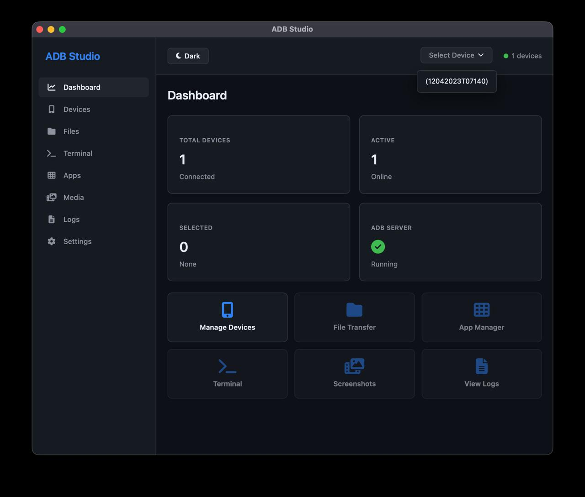
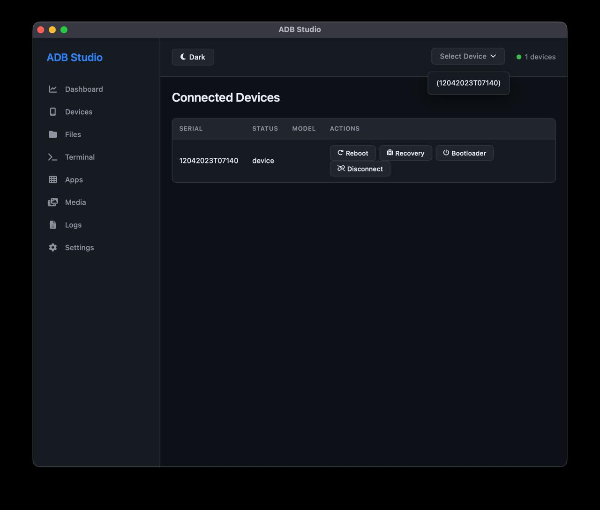

# ADB Studio


Modern, cross-platform Android Debug Bridge (ADB) GUI application built with Rust and Dioxus.

## Screenshots





## Features

- **Device Management**: Auto-detect and manage multiple Android devices
- **App Manager**: Install/uninstall APK files with progress tracking
- **File Operations**: Push/pull files between device and computer
- **Terminal**: Execute ADB shell commands
- **Media**: Take screenshots and record screen
- **Log Viewer**: Real-time logcat monitoring
- **Dark/Light Theme**: Toggle between themes
- **Custom Device Selector**: Dropdown menu for easy device switching

## Tech Stack

- **Rust**: Core application logic
- **Dioxus**: Reactive UI framework and desktop application
- **ADB**: Android Debug Bridge integration
- **Font Awesome**: Vector icons

## Requirements

- Rust 1.70+
- ADB installed and in PATH (or configure custom path in Settings)
- Android device with USB debugging enabled

## Installation

```bash
# Clone the repository
git clone <repository-url>
cd adb_studio

# Build and run
cargo run
```

## Usage

1. **Connect Device**: Connect your Android device via USB or WiFi
2. **Select Device**: Use the dropdown in the top toolbar to select your device
3. **Navigate**: Use the sidebar to access different features
4. **Install APK**: Go to Apps → Install APK → Select file → Progress bar shows installation status
5. **Uninstall App**: Go to Apps → Click package from list → Uninstall App

## Configuration

Settings can be configured in the Settings page:

- Custom ADB path
- Theme preference (Dark/Light)

## Development

### Recommended IDE Setup

[VS Code](https://code.visualstudio.com/) + [rust-analyzer](https://marketplace.visualstudio.com/items?itemName=rust-lang.rust-analyzer) + [Dioxus](https://marketplace.visualstudio.com/items?itemName=DioxusLabs.dioxus)

### Project Structure

```
src/
├── main.rs           # Entry point with embedded CSS
├── app.rs            # Main app component with routing
├── adb.rs            # ADB command wrappers
├── app_manager.rs    # APK install/uninstall
├── fileops.rs        # File push/pull operations
├── terminal.rs       # Shell command execution
├── media.rs          # Screenshot/recording
├── log_viewer.rs     # Logcat viewer
├── settings.rs       # App settings
└── device.rs         # Device parsing
```

## License

MIT
